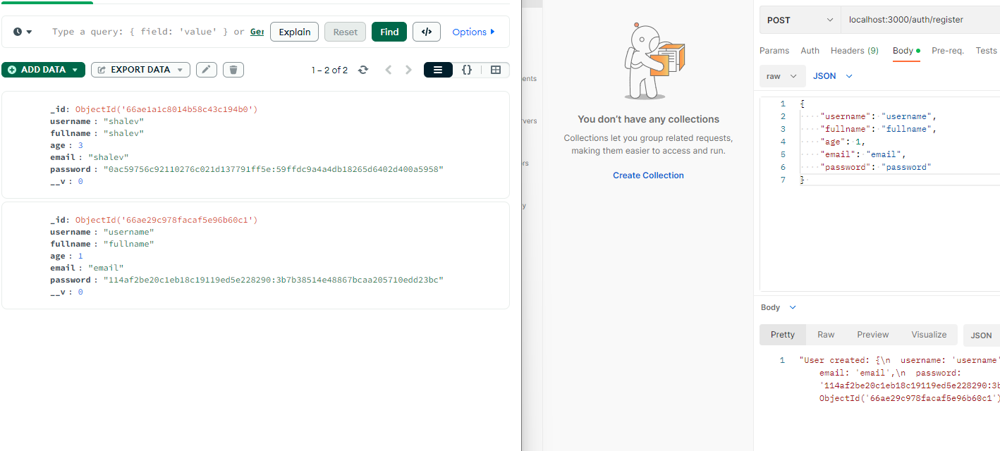

This project is node server that deal with users and movies.
It using:
Express,
Typescript,
MongoDB - mongoose,
JWT - login, register, full authentication,
Crypto - encrypt/decrypt password in db,
Sessions - session id, cookie, middleware.

For using it:
1/ create mongo data base named db and two collections: user and movie:

2/ Do register request:
POST
/auth/register
{
"username": "username",
"fullname": "fullname",
"age": 1,
"email": "email",
"password": "password"
}

3/ Then do login
POST
/auth/login
{
"email": "email",
"password": "password"
}

4/ Now use the token you got at the login, put it in header named Authorizration, and you can do any request you want:
get all users - /user/data,
get user by id - /user/:id,
update user - /user/update/:id,
delete user - /user/delete/:id,
get all movies - /movie/data,
get movie by id - /movie/:id,
get movie by externalId - /movie/:externalId,
create movie - /movie/create/:id,
update movie - /movie/update/:id,
delete movie - /movie/delete/:id.

base url: localhost:3000

movie model:
{
"movie_name": "movie_name",
"movie_length": "movie_length",
"movie_imageUrl": "movie_imageUrl",
}
(when you create or updtae, if you add "externalId" it will not be considered)

Pay attention - you are limited in actions, by default you have only 100.
You can change it in .env and check for remaining amount in the session.json file

